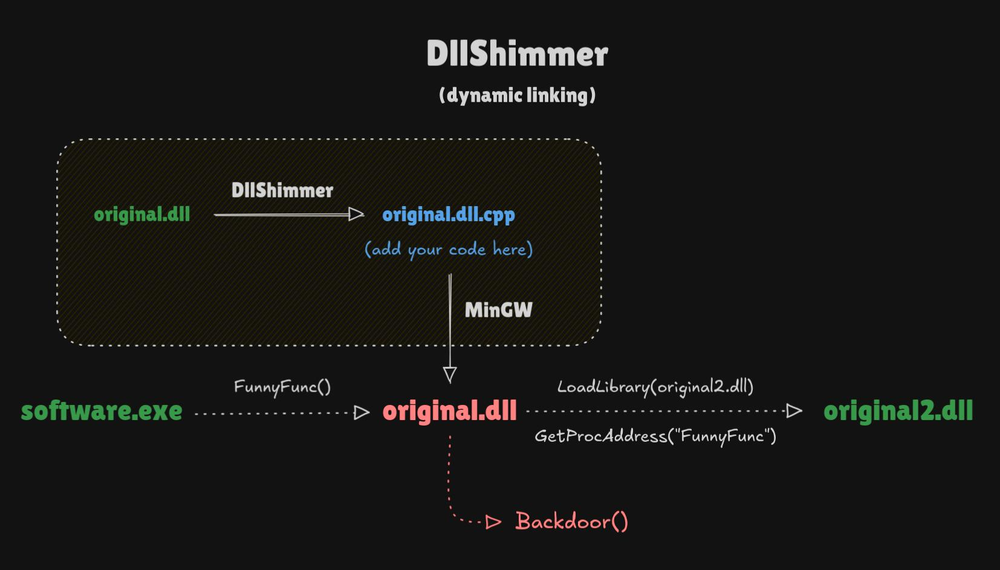

# DllShimmer

<div style="text-align:center;font-style: italic;">Weaponize DLL hijacking easily. Backdoor any function in any DLL without disrupting normal process operation.</div>



## How it works

DllShimmer parses the original DLL and extracts information about exported functions (name, ordinal number, and forwarder info). Based on this information, DllShimmer creates a boilerplate C++ file (`.cpp`). **The generated file allows you to add your own code to each function exported from the original DLL without disrupting the normal operation of the program.** No reverse engineering or instrumentation is required, because DllShimmer does not rely on function signatures (see more in “Limitations”).

The second file generated is a `.def` file, which ensures that all DLLs exported from the proxy after compilation will have the same names and ordinal numbers as in the original DLL.

**After compilation, the EAT in the proxy DLL is an exact copy of the EAT in the original DLL. All names and ordinal numbers of exported functions match, and forwarded functions are forwarded as well.** DllShimmer does not explicitly forward all functions (like most tools), creating a completely new and suspicious EAT structure.

## Installation

Compile Go source code or [download the compiled binary](https://github.com/Print3M/DllShimmer/releases).

**Dependencies**:

- `x86_64-w64-mingw32-g++`
- `x86_64-w64-mingw32-dlltool`

## Usage

Example:

```bash
# Backdoor version.dll (proxy to absolute path)
./DllShimmer -i version.dll -o project/ -x "C:/Windows/System32/version.dll" -m

# Backdoor random chat.dll (proxy to relative path)
./DllShimmer -i chat.dll -o project/ -x "lib/chat2.dll" -m

# Backdoor random app.dll (static linking to the original DLL)
./DllShimmer -i app.dll -o project/ -x "app2.dll" -m --static
```

Parameters:

**`-i / --input <file>`** [required]

The original DLL that you want to backdoor.

**`-o / --output <dir>`** [required]

The path to the directory where DllShimmer will save all generated files.

**`-x / --original-path <path | file>`** [required]

In case of dynamic linking (default) provide the path where the proxy DLL will find the original DLL on the target system.

In the case of static linking (`--static`), specify only the name of the original DLL. It will be searched for according to the default loading order on Windows.

**`-m / --mutex`** [optional]

Enabling this option will add a mutex to the source file, which prevents your backdoor from being executed more than once during a single program run. All original functions will continue to work normally.

**`--static`** [optional]

Enable static linking between the proxy DLL (IAT) and the original DLL (EAT). This generates an additional `.lib` file in the output directory, which acts as the original DLL for static compilation.

This technique has some serious limitations compared to dynamic linking:

- You cannot define a full or relative path to the original DLL. The system loader only uses the DLL name form proxy IAT and searches in the default paths.
- Limited debugging information. If the original DLL fails to load, the program will usually crash without additional information.
  
However, static linking may be more stealthy and natural in some scenarios.

By default, DllShimmer always uses dynamic linking with the `LoadLibraryA()` and `GetProcAddress()` functions.

## Limitations

- Only x86-64 / AMD64 architecture is supported.
- Most likely, the generic proxy code will not work for functions with floating-point parameters, as they use different registers than integer ones utilized by DllShimmer. If you know the function signature, you can manually adjust it in the generated file.
- Functions with more than 12 arguments will not work because this number has been hardcoded into DllShimmer templates.
- There are some huge obfuscated DLLs with weird name mangling, calling conventions and tricks (e.g. compiled Qt framework DLL). I don't recommend to use them as a proxy DLL. DllShimmer most probably will generate some garbage in this case.

## Troubleshooting

### _In the generated `.cpp` file, I don't see all the exported functions from the original DLL._

Functions defined in the original DLL as “forwarded” are not included in the `.cpp` file. However, they are visible in the `.def` file. They will also be exported after compilation, exactly as in the original DLL.

### _Strange loader error (126) while loading original DLL_

Sometimes, your proxy DLL displays an error when loading the original DLL, and the error code is 126, even though you theoretically specified the correct relative path in the `-x` parameter. Why isn't it working?!?

DLLs are searched for in the `Current Directory`. In 98% of cases, this is simply the location of the main EXE file, but there are programs (mostly old legacy ones) that arbitrarily change the `Current Directory` using, for example, `SetCurrentDirectoryW()`. The main program is aware of this change, so it loads your proxy DLL correctly, but you are unaware of this and try to load the original DLL relatively, while the program searches for it in the changed `Current Directory`.

This rule applies to both static and dynamic loading of the original DLL. Unfortunately, with static linking, this problem is much harder to detect because we don't have debug information. System loader just fails and it's over. This is why I always recommend using the default dynamic linking first.

In the case of dynamic linking, we have two options:

1. Adjust the path in the `-x` parameter to the new `Current Directory` situation.
2. Change the `Current Directory` dynamically to search for DLLs where we want.

In case of static linking, we really only have one option:

1. Move the original DLL to the `Current Directory`.

## TODO

- Cache LoadLibraryA() and GetProcAddress() pointers not to call WinAPI every time (better performance and more stealthy).
- Improve the shim template code (leave as little code in the macro as possible. Is the macro actually required now when we use args/params trick?)
- Maybe move boilerplate code into header file?
